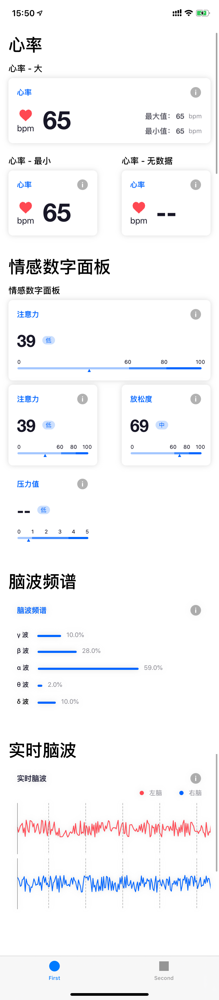

# 情感云实时数据UI Demo

## 简介

本工程主要展示了`EnterAffectiveCloudUI`库中的实时数据UI模版

## 运行环境

UI SDK请参见[EnterAffectiveCloudUI](../EnterAffectiveCloudUI/)

Demo使用`Cocopods`管理依赖库，使用前要先对工程主目录运行`pod install`。

## 工程说明

### 运行环境

- Xcode 11  
- iOS 13

### 注意事项

本工程由storyboard设置UI布局，代码设置参数。

### 页面展示

