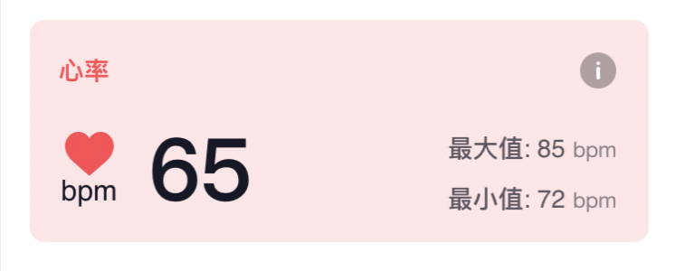
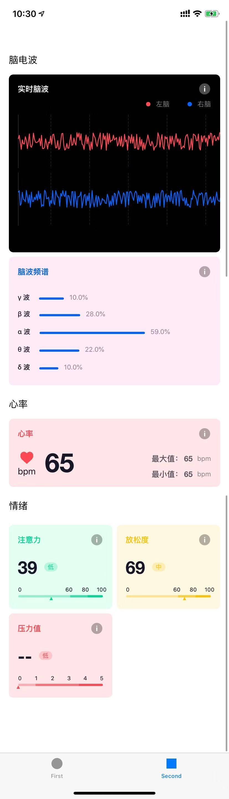
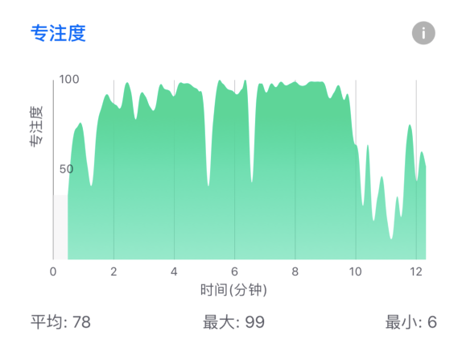
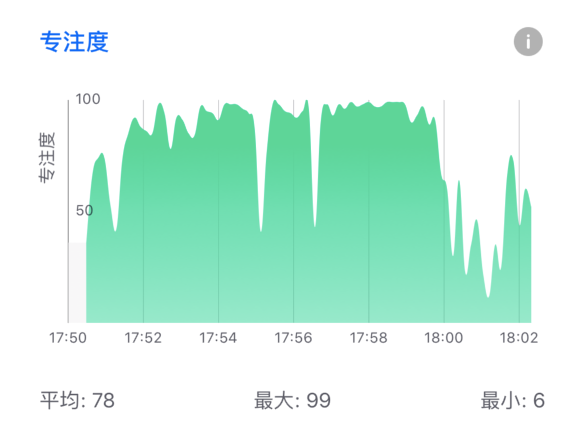
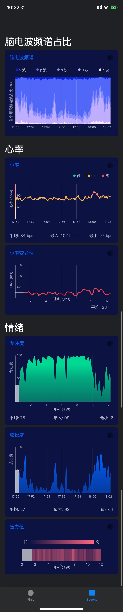

# Enter-AffectiveCloud-iOS-SDK

# 目录

- [Enter-AffectiveCloud-iOS-SDK](#enter-affectivecloud-ios-sdk)
- [目录](#%e7%9b%ae%e5%bd%95)
- [SDK 说明](#sdk-%e8%af%b4%e6%98%8e)
  - [结构说明](#%e7%bb%93%e6%9e%84%e8%af%b4%e6%98%8e)
  - [安装集成](#%e5%ae%89%e8%a3%85%e9%9b%86%e6%88%90)
    - [版本需求](#%e7%89%88%e6%9c%ac%e9%9c%80%e6%b1%82)
    - [Cocoapods](#cocoapods)
  - [快速接入](#%e5%bf%ab%e9%80%9f%e6%8e%a5%e5%85%a5)
  - [情感云API使用说明](#%e6%83%85%e6%84%9f%e4%ba%91api%e4%bd%bf%e7%94%a8%e8%af%b4%e6%98%8e)
- [情感云数据标准UI](#%e6%83%85%e6%84%9f%e4%ba%91%e6%95%b0%e6%8d%ae%e6%a0%87%e5%87%86ui)
  - [实时数据UI](#%e5%ae%9e%e6%97%b6%e6%95%b0%e6%8d%aeui)
  - [报表UI](#%e6%8a%a5%e8%a1%a8ui)
  - [情感云UI详细API](#%e6%83%85%e6%84%9f%e4%ba%91ui%e8%af%a6%e7%bb%86api)

# SDK 说明

回车情感云可以根据用户的脑波数据和心率数据来进行高级情绪情感数据分析的一个云算法平台，同时能给出包括：放松度、注意力、愉悦值，压力值、激动度（内测）在内的多种情绪情感值。详情请查看[官网](https://www.entertech.cn)。

在开始开发前，请先查看回车情感云的[开发文档](https://docs.affectivecloud.com)，了解情感云平台的架构和所能提供的服务具体说明，确定好你的应用中所需要的服务。你还需要联系管理员注册好测试应用，然后再进行开发。

为了方便你进行 iOS 平台的快速开发，我们提供了情感云快速开发 SDK，通过本 SDK 你可以快速地将情感云的能力集成到你的 app 中。

## 结构说明

- `EnterAffectiveCloud` 业务层只需要实例化 `AffectiveCloudClient` 类就可以请求情感云数据，通过代理 `AffectiveCloudResponseDelegate` 来获取情感云分析后的结果。`
- `EnterAffectiveCloudUI` 提供了各UI模块用以展示实时数据和报表数据(可选)


## 安装集成

### 版本需求
- Xcode 10.2
- Swift 5.0

### Cocoapods

添加下面内容到你的 Podfile。

```
# 指定 pod 仓库源
source 'git@github.com:EnterTech/PodSpecs.git'

target 'Your Target' do
    pod 'EnterAffectiveCloud', '~> 1.3.6'
    pod 'EnterAffectiveCloudUI', '~> 1.3.6'  #(可选)
end
```
运行 `pod  install` 安装命令.

## 快速接入

**对象初始化**

```swift
// AffectiveCloudClient对象创建
let client = AffectiveCloudClient(websocketURLString: yourURL, appKey: yourAppKey, appSecret: yourSecret, userID: yourLocalID)

```

**服务订阅**

```swift
// 请求生物信号数据
self.client.initBiodataServices(services: [.EEG, .HeartRate])

// 请求情感数据
self.client.startAffectiveDataServices(services: [.attention, .relaxation, .pleasure, .pressure])

// 订阅生物信号
self.client.subscribeBiodataServices(services: [.eeg_all, .hr_all])

// 订阅情感数据
self.client.subscribeAffectiveDataServices(services: [.attention, .relaxation, .pressure, .pleasure])
```

**获取报表**

```swift
// 获取生物数据报表
self.client.getBiodataReport(services: [.EEG, .HeartRate])

// 获取情感数据报表
self.client.getAffectiveDataReport(services: [.relaxation, .attention, .pressure, .pleasure])

```

**实现代理方法**

```swift
self.client.affectiveCloudDelegate = self
```

继承`AffectiveCloudResponseDelegate`,并实现以下回调

```swift
// 生物数据订阅
func biodataServicesSubscribe(client: AffectiveCloudClient, response: AffectiveCloudResponseJSONModel) {
    if response.code != 0 {
        return
    }
        
    if let data = response.dataModel as? CSBiodataProcessJSONModel {
        if let eeg = data.eeg {
        // eeg.waveLeft, eeg.waveRight, eeg.alpha..
        // 在此获取您需要的脑波数据
        }
        if let hr = data.hr {
        // 在此获取您需要的心率数据
        }
    }
}

// 生物数据报表
func biodataServicesReport(client: AffectiveCloudClient, response: AffectiveCloudResponseJSONModel) {
    if response.code != 0 {
        return
    }
    if let data = response.dataModel as? CSBiodataReportJsonModel {
        if let hr = data.hr {
          // hr, hrv等报表数据
        }
        if let eeg = data.eeg {
          // eeg相关报表数据
        }
    }
}

// 情感数据订阅
func affectiveDataSubscribe(client: AffectiveCloudClient, response: AffectiveCloudResponseJSONModel) {
    if response.code != 0 {
        return
    }
        
    if let data = response.dataModel as? CSAffectiveSubscribeProcessJsonModel {
        if let attention = data.attention?.attention {
            print("attention \(attention)")
        }
        if let relaxation = data.relaxation?.relaxation {

        }
        if let pressure = data.pressure?.pressure {

        }
    }
}

// 情感数据报表
func affectiveDataReport(client: AffectiveCloudClient, response: AffectiveCloudResponseJSONModel)  {
    guard response.code == 0 else {
        return
    }
    if let report = response.dataModel as? CSAffectiveReportJsonModel {
        if let attention = report.attention {
        // array, average
        }
        if let relaxation = report.relaxation {

        }
        if let pressure = report.pressure {
        }
    }
}
```

**结束情感云**

```swift
// 结束情感数据服务
self.client.finishAffectiveDataServices(services: [.attention, .relaxation, .pressure, .pleasure])
// 关闭会话
self.client.closeSession()

self.client.websocketDisconnect()

```

## 情感云API使用说明
- 情感云的API文档请查看：[情感云API文档](APIDocuments/Enterr-AffectiveCloud-iOS-SDK-API说明.md)

# 情感云数据标准UI

为了方便用户接入, 我们提供了数据展示UI的标准模版, 分为实时数据UI和报表UI

## 实时数据UI

在此以心率为例, 展示如何接入实时UI

**接入**

```swift
let hrView = RealtimeHeartRateView()
// 设置属性, 相关属性请参阅《情感云UI详细API》
hrView.bgColor = UIColor(red: 1, green: 229.0/255.0, blue: 231.0/255.0, alpha: 1)
hrView.mainColor = UIColor(red: 1, green: 72.0/255.0, blue: 82.0/255.0, alpha: 1)
self.view.addSubview(hrView)
hrView.snp.makeConstraints {
  $0.left.right.equalTo(16)
  $0.hight.equalTo(123) //高度不可定制
  //...其他约束
}

// 开启监听, 开启情感云后会自动更新界面上的心率数据
hrView.observe()
```



**完整图示**



## 报表UI

在此以注意力报表为例, 展示如何接入报表UI

**接入**

```swift

let attentionReportView = AttentionReportView()
self.view.addSubview(attentionReportView)
attentionReportView.snp.makeConstraints {
  $0.left.right.equalTo(16)
  $0.hight.equalTo(298) // 高度不可定制
  //...其他约束
}
// 平均值
attentionReportView.avgValue = 78
// 最大值
attentionReportView.maxValue = 99
// 最小值
attentionReportView.minValue = 6
// 图表数组
attentionReportView.setDataFromModel(attention: intArray)

```
setDataFromModel 方法有两个参数

| 参数      | 类型     | 说明             |
| --------- | -------- | ---------------- |
| attention | Int 数组 | 组成列表的数据   |
| timestamp | Int      | 情感云的起始时间, 可不设置 |

不传timestamp参数时, X轴坐标


传入timestamp时, X轴坐标


**完整图示**

在暗色模式下,经过定制可作出如下效果


## 情感云UI详细API
- 情感云UI的API文档请查看: [情感云UI文档](APIDocuments/AffectiveCloudUI.md)