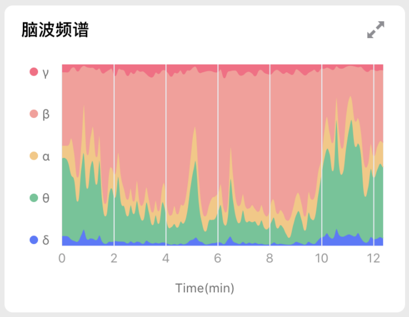
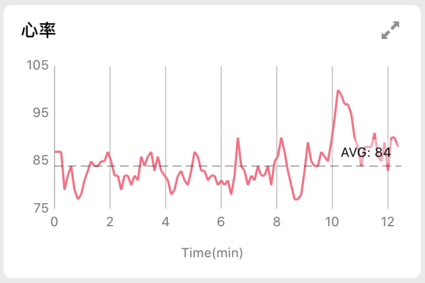
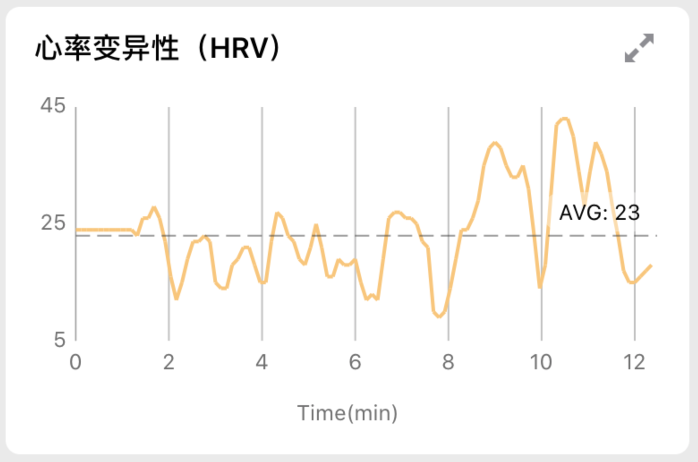
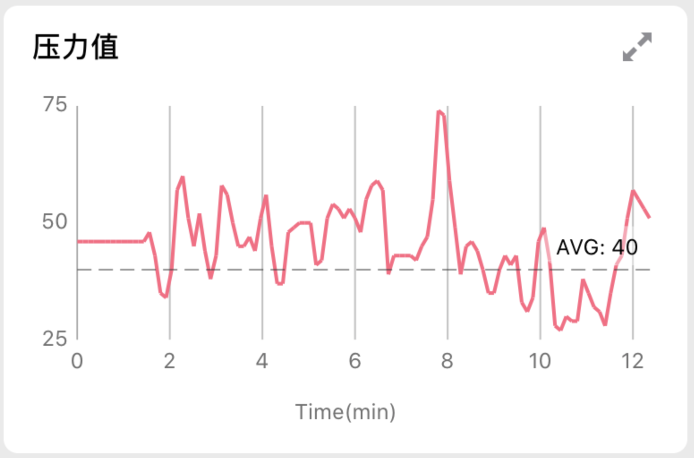

# Enter-AffectiveCloud-iOS-SDK

# 目录

* [目录](#目录)
* [SDK 说明](#SDK-说明)
  * [结构说明](#结构说明)
  * [安装集成](#安装集成)
    * [版本需求](#版本需求)
    * [Cocoapods](#Cocoapods)
  * [API情感云API使用说明](#情感云API使用说明)
  * [情感云UI](#情感云UI)
    * [实时数据UI](#实时数据UI)
    * [报表数据UI](#报表数据UI)

# SDK 说明

回车情感云可以根据用户的脑波数据和心率数据来进行高级情绪情感数据分析的一个云算法平台，同时能给出包括：放松度、注意力、愉悦值，压力值、激动度（内测）在内的多种情绪情感值。详情请查看[官网](https://www.entertech.cn)。

在开始开发前，请先查看回车情感云的[开发文档](https://docs.affectivecloud.com)，了解情感云平台的架构和所能提供的服务具体说明，确定好你的应用中所需要的服务。你还需要联系管理员注册好测试应用，然后再进行开发。

为了方便你进行 iOS 平台的快速开发，我们提供了情感云快速开发 SDK，通过本 SDK 你可以快速地将情感云的能力集成到你的 app 中。

## 结构说明

- `EnterAffectiveCloud` 业务层只需要实例化 `AffectiveCloudClient` 类就可以请求情感云数据，通过代理 `AffectiveCloudResponseDelegate` 来获取情感云分析后的结果。`
- `EnterAffectiveCloudUI` 提供了各UI模块用以展示实时数据和报表数据

## 安装集成

### 版本需求
- Xcode 10.2
- Swift 5.0

### Cocoapods

添加下面内容到你的 Podfile。

~~~ruby
# 指定 pod 仓库源
source 'git@github.com:EnterTech/PodSpecs.git'

target 'Your Target' do
    pod 'EnterAffectiveCloud', '~> 1.2.0'
    pod 'EnterAffectiveCloudUI', '~> 1.2.0'
end
~~~

运行 `pod  install` 安装命令.

## 情感云API使用说明
- 情感云的API文档请查看：[情感云API文档](API-Documents/Enterr-AffectiveCloud-iOS-SDK-API说明.md)

## 情感云UI

### 实时数据UI

**RealtimeHeartRateView**

| 参数               | 类型    | 默认值                         | 说明                                                                                                                                   |
| ------------------ | ------- | ------------------------------ | -------------------------------------------------------------------------------------------------------------------------------------- |
| mainColor          | UIColor | `#0064FF`                      | 主色(默认值为RGB显示颜色，如此处对应的是`UIColor(red: 0x23/255.0, green: 0x23/255.0, blue: 0x3a/255.0, alpha: 1)`，alpha必须为1，下同) |
| textColor          | UIColor | `#FFFFFF`                      | 字体颜色                                                                                                                               |
| bgColor            | UIColor | `#000000`                      | 背景色                                                                                                                                 |
| borderRadius       | CGFloat | 8.0                            | 圆角                                                                                                                                   |
| isShowExtremeValue | Bool    | true                           | 是否显示心率最大最小值                                                                                                                 |
| isShowInfoIcon     | Bool    | true                           | 是否显示‘说明’图标                                                                                                                     |
| infoUrlString      | String  | `"https://demo.entertech.com"` | 实时数据说明网页链接                                                                                                                   |
| buttonImageName    | String  | `"info_button_icon"`           | 按钮图片                                                                                                                               |

**RealtimeAttentionView & RealtimeRelaxationView & RealtimePressureView**

| 参数            | 类型    | 默认值                         | 说明                 |
| --------------- | ------- | ------------------------------ | -------------------- |
| mainColor       | UIColor | `#0064FF`                      | 主色                 |
| textColor       | UIColor | `#FFFFFF`                      | 字体颜色             |
| bgColor         | UIColor | `#000000`                      | 背景                 |
| borderRadius    | CGFloat | 8.0                            | 圆角                 |
| isShowInfoIcon  | Bool    | true                           | 是否显示‘说明’图标   |
| infoUrlString   | String  | `"https://demo.entertech.com"` | 实时数据说明网页链接 |
| buttonImageName | String  | `"info_button_icon"`           | 按钮图片             |

**RealtimeBrainwaveSpectrumView**

| 参数            | 类型    | 默认值                         | 说明                 |
| --------------- | ------- | ------------------------------ | -------------------- |
| mainColor       | UIColor | `#0064FF`                      | 主色                 |
| textColor       | UIColor | `#FFFFFF`                      | 字体颜色             |
| textFont        | String  | `"PingFangSC-Semibold"`        | 字体                 |
| bgColor         | UIColor | `#000000`                      | 背景                 |
| borderRadius    | CGFloat | 8.0                            | 圆角                 |
| isShowInfoIcon  | Bool    | true                           | 是否显示‘说明’图标   |
| infoUrlString   | String  | `"https://demo.entertech.com"` | 实时数据说明网页链接 |
| buttonImageName | String  | `"info_button_icon"`           | 按钮图片             |

**RealtimeBrainwaveView**

| 参数                    | 类型    | 默认值                         | 说明                 |
| ----------------------- | ------- | ------------------------------ | -------------------- |
| mainColor               | UIColor | `#0064FF`                      | 主色                 |
| textColor               | UIColor | `#FFFFFF`                      | 字体颜色             |
| textFont                | String  | `"PingFangSC-Semibold"`        | 字体                 |
| bgColor                 | UIColor | `#000000`                      | 背景                 |
| borderRadius            | CGFloat | 8.0                            | 圆角                 |
| isShowInfoIcon          | boolean | true                           | 是否显示‘说明’图标   |
| leftBrainwaveLineColor  | UIColor | `#FF4852`                      | 左脑波曲线颜色       |
| rightBrainwaveLineColor | UIColor | `#0064FF`                      | 右脑波曲线颜色       |
| infoUrlString           | String  | `"https://demo.entertech.com"` | 实时数据说明网页链接 |
| buttonImageName         | String  | `"info_button_icon"`           | 按钮图片             |

### 报表数据UI

**BrainSpecturmReportView**

| 参数               | 类型      | 默认值                                      | 说明                                      |
| ------------------ | --------- | ------------------------------------------- | ----------------------------------------- |
| mainColor          | UIColor   | `#0064FF`                                   | 主色                                      |
| textColor          | UIColor   | `#FFFFFF`                                   | 字体颜色                                  |
| bgColor            | UIColor   | `#000000`                                   | 背景                                      |
| isShowInfoIcon     | Bool      | true                                        | 是否显示说明图标                          |
| isAbsoluteTimeAxis | Bool      | false                                       | 是否为绝对时间轴                          |
| sample             | Int       | 3                                           | 采样率，表示几个点采一个，默认3个点采一个 |
| spectrumColors     | [UIColor] | `[#23233A,#23233A,#23233A,#23233A,#23233A]` | 各个占比颜色，一次对应γ，β，α，θ，δ       |
| buttonImageName    | String    | `"info_button_icon"`                        | 按钮图片                                  |
| borderRadius       | CGFloat   | 8                                           | 圆角                                      |
| infoUrlString      | String    | `https://demo.com`                          | 按钮打开的说明网页                        |

**HeartRateReportView**

| 参数                | 类型      | 默认值                           | 说明                                      |
| ------------------- | --------- | -------------------------------- | ----------------------------------------- |
| mainColor           | UIColor   | `#0064FF`                        | 主色                                      |
| textColor           | UIColor   | `#FFFFFF`                        | 字体颜色                                  |
| bgColor             | UIColor   | `#000000`                        | 背景                                      |
| isShowInfoIcon      | Bool      | true                             | 是否显示说明图标                          |
| isAbsoluteTimeAxis  | Bool      | false                            | 是否为绝对时间轴                          |
| sample              | Int       | 3                                | 采样率，表示几个点采一个，默认3个点采一个 |
| isShowAvg           | Bool      | true                             | 是否展示平均值                            |
| isShowMax           | Bool      | true                             | 是否展示最大值                            |
| isShowMin           | Bool      | true                             | 是否展示最小值                            |
| heartRateLineColors | [UIColor] | [`#23233A`, `#23233A`,`#23233A`] | 心率较高曲线颜色(依次为高，中， 低)       |
| buttonImageName     | String    | `"info_button_icon"`             | 按钮图片                                  |
| borderRadius        | CGFloat   | 8                                | 圆角                                      |
| infoUrlString       | String    | `https://demo.com`               | 按钮打开的说明网页                        |

**HeartRateVariablityReportView**

| 参数               | 类型    | 默认值               | 说明                                      |
| ------------------ | ------- | -------------------- | ----------------------------------------- |
| mainColor          | UIColor | `#0064FF`            | 主色                                      |
| textColor          | UIColor | `#FFFFFF`            | 字体颜色                                  |
| bgColor            | UIColor | `#000000`            | 背景                                      |
| isShowInfoIcon     | Bool    | true                 | 是否显示说明图标                          |
| isAbsoluteTimeAxis | Bool    | false                | 是否为绝对时间轴                          |
| sample             | Int     | 3                    | 采样率，表示几个点采一个，默认3个点采一个 |
| isShowAvg          | Bool    | true                 | 是否展示平均值                            |
| lineColor          | UIColor | `#23233A`            | 曲线颜色                                  |
| buttonImageName    | String  | `"info_button_icon"` | 按钮图片                                  |
| borderRadius       | CGFloat | 8                    | 圆角                                      |
| infoUrlString      | String  | `https://demo.com`   | 按钮打开的说明网页                        |

**RelaxationReportView & AttentionReportView**

| 参数               | 类型    | 默认值               | 说明                                      |
| ------------------ | ------- | -------------------- | ----------------------------------------- |
| mainColor          | UIColor | `#0064FF`            | 主色                                      |
| textColor          | UIColor | `#FFFFFF`            | 字体颜色                                  |
| bgColor            | UIColor | `#000000`            | 背景                                      |
| isShowInfoIcon     | Bool    | true                 | 是否显示说明图标                          |
| isAbsoluteTimeAxis | Bool    | false                | 是否为绝对时间轴                          |
| sample             | Int     | 3                    | 采样率，表示几个点采一个，默认3个点采一个 |
| isShowAvg          | Bool    | true                 | 是否展示平均值                            |
| isShowMax          | Bool    | true                 | 是否展示最大值                            |
| isShowMin          | Bool    | true                 | 是否展示最小值                            |
| fillColor          | UIColor | `#23233A`            | 填充颜色                                  |
| buttonImageName    | String  | `"info_button_icon"` | 按钮图片                                  |
| borderRadius       | CGFloat | 8                    | 圆角                                      |
| infoUrlString      | String  | `https://demo.com`   | 按钮打开的说明网页                        |

**PressureChart**

| 参数               | 类型    | 默认值               | 说明                                      |
| ------------------ | ------- | -------------------- | ----------------------------------------- |
| mainColor          | UIColor | `#0064FF`            | 主色                                      |
| textColor          | UIColor | `#FFFFFF`            | 字体颜色                                  |
| bgColor            | UIColor | `#000000`            | 背景                                      |
| isShowInfoIcon     | Bool    | true                 | 是否显示说明图标                          |
| isAbsoluteTimeAxis | Bool    | false                | 是否为绝对时间轴                          |
| sample             | Int     | 3                    | 采样率，表示几个点采一个，默认3个点采一个 |
| chartColor         | UIColor | `#23233A`            | 填充颜色                                  |
| buttonImageName    | String  | `"info_button_icon"` | 按钮图片                                  |
| borderRadius       | CGFloat | 8                    | 圆角                                      |
| infoUrlString      | String  | `https://demo.com`   | 按钮打开的说明网页                        |
